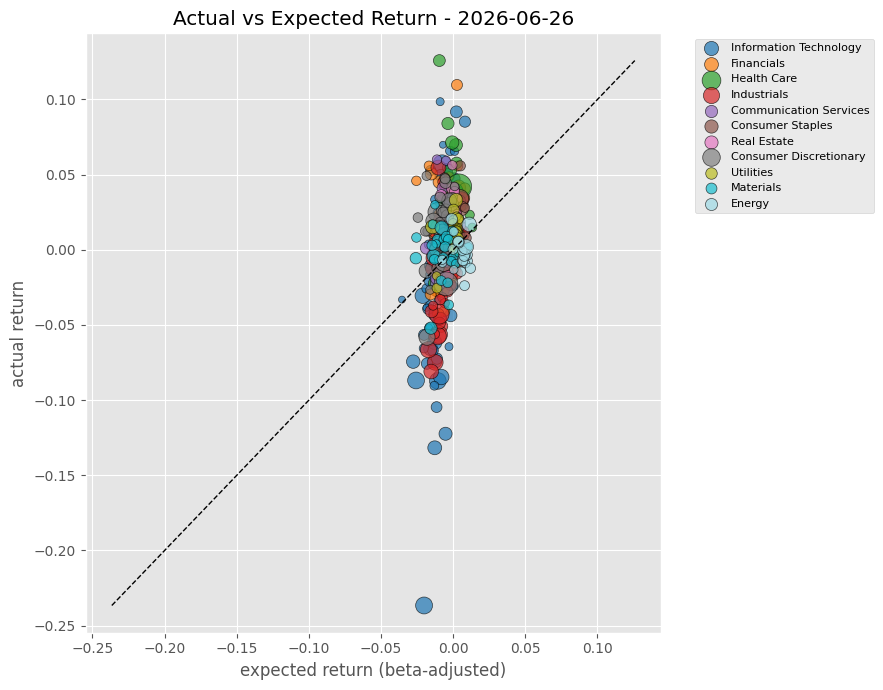
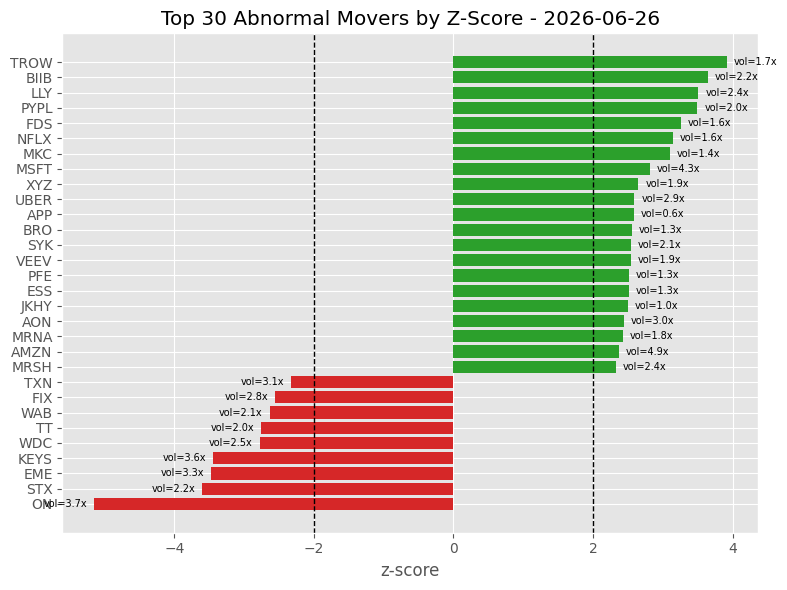
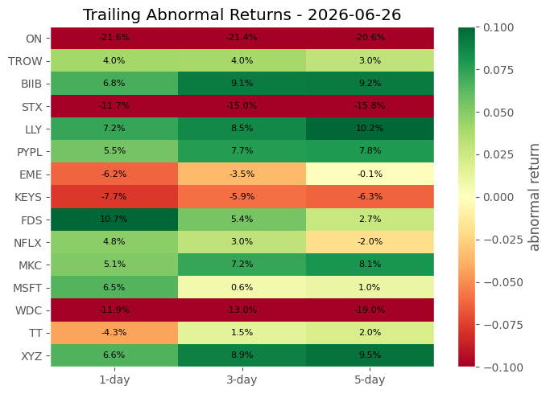

# S&P 500 Momentum Scanner

[](https://colab.research.google.com/github/PrathamDudani/sp500-momentum-scanner/blob/main/sp500_momentum_scanner.ipynb)


## Visualizations

### Actual vs Expected Return


### Top 30 Abnormal Movers


### Trailing Abnormal Returns Heatmap


A quantitative momentum scanner for S&P 500 stocks that identifies abnormal movers using **residual (market-adjusted) returns**, rolling beta/alpha estimation, z-score normalization, and volume confirmation — built entirely with free data sources.

---

## What It Does

Most momentum strategies rank stocks purely by raw returns — but raw returns include the overall market move. A stock returning +3% on a day SPY returns +3% isn't actually doing anything special.

This scanner strips out the market component using **CAPM regression**, isolates the stock-specific (residual) return, and ranks stocks by how statistically unusual that residual is — giving a much cleaner momentum signal.

---

## Methodology

```
1. Fetch S&P 500 universe + sectors  →  Wikipedia (web scraping)
2. Download 1-year OHLCV data        →  yfinance
3. Estimate rolling beta & alpha     →  RollingOLS (60-day window)
4. Compute residual returns          →  actual - (alpha + beta × SPY)
5. Normalize via z-score             →  20-day rolling mean & std
6. Compound residuals                →  3-day and 5-day windows
7. Volume confirmation               →  ratio vs 20-day average
8. Flag high-confidence signals      →  |z-score| > 2.0 AND volume > 1.5×
9. Fetch news headlines              →  EODHD News API
```

---

## Key Features

- **Market-neutral signal** — residual returns isolate stock-specific momentum, not market drift
- **Lookahead-bias free** — beta, alpha, and rolling stats are always shifted by 1 day before use
- **Multi-timeframe momentum** — 1-day, 3-day, and 5-day compounded residuals
- **Volume confirmation** — filters noise by requiring above-average volume for high-confidence signals
- **Fully free data** — yfinance + Wikipedia (no paid data subscription needed for core scanner)
- **Sector-aware visualization** — scatter plot, bar chart, and heatmap colored by GICS sector

---

## Visualizations

| Chart | What It Shows |
|-------|--------------|
| Actual vs Expected Return (scatter) | Which stocks beat/missed CAPM prediction, sized by volume |
| Top 30 Abnormal Movers (bar chart) | Z-score leaderboard with ±2σ threshold lines |
| Trailing Abnormal Returns (heatmap) | 1/3/5-day residual momentum consistency per stock |

---

## Tech Stack

| Library | Purpose |
|---------|---------|
| `yfinance` | Free OHLCV data from Yahoo Finance |
| `pandas` | Data manipulation |
| `numpy` | Numerical computation |
| `statsmodels` | RollingOLS regression |
| `matplotlib` | Visualizations |
| `requests` + `pd.read_html` | Wikipedia scraping for S&P 500 universe |

---

## Setup & Usage

### Run in Google Colab (recommended)
Click the **Open in Colab** badge at the top. No local setup needed.

### Run locally

```bash
git clone https://github.com/PrathamDudani/sp500-momentum-scanner.git
cd sp500-momentum-scanner
pip install yfinance pandas numpy statsmodels matplotlib requests
jupyter notebook sp500_momentum_scanner.ipynb
```

### API Key (optional)
The news fetching cell uses the EODHD API. Replace the placeholder with your own key:
```python
api_key = 'YOUR_API_KEY_HERE'
```
Get a free key at [eodhd.com](https://eodhd.com). The rest of the scanner works without it.

---

## Output Example

On any given scan date, the scanner produces:

- A ranked `queue` DataFrame of all ~500 stocks with residuals, z-scores, betas, and volume ratios
- A `high_confidence` flag for stocks crossing both the z-score and volume thresholds
- Recent news headlines for the top 10 candidates
- Three visualizations summarizing the day's momentum landscape

---

## Project Structure

```
p500-momentum-scanner/
│
├── sp500_momentum_scanner.ipynb   # Main notebook
├── README.md
└── assets/
    ├── scatter.png                # Actual vs Expected Return chart
    ├── barchart.png               # Top 30 Abnormal Movers chart
    └── heatmap.png                # Trailing Abnormal Returns heatmap
```

---

## Author

**Pratham Dudani**
BSc Data Science, Techno India University, Kolkata
[GitHub](https://github.com/PrathamDudani) · [LinkedIn](www.linkedin.com/in/pratham-dudani-)

---

## License

MIT License — free to use, modify, and distribute.
